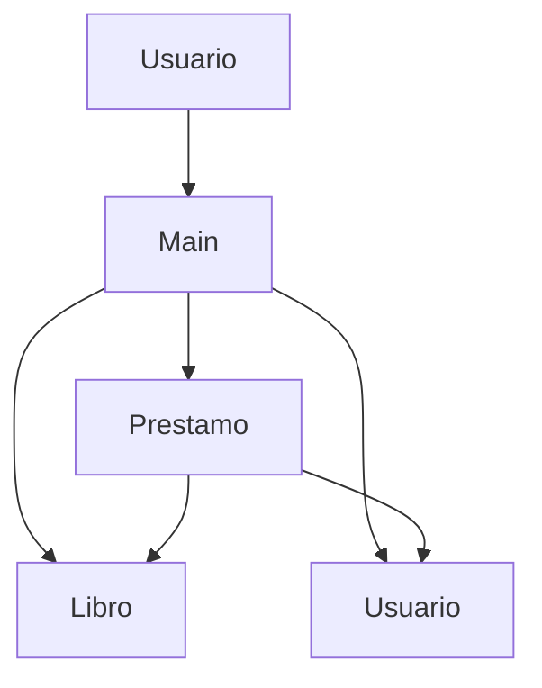

<p align="center">
  
</p>

# Sistema de Gestión de Biblioteca

Aplicación de consola desarrollada en **Java** para gestionar libros, usuarios y préstamos mediante programación orientada a objetos y arrays de objetos.

## ✨ Características

- Consulta de libros y usuarios registrados.
- Registro de préstamos y devoluciones.
- Búsqueda de libros por código.
- Consulta de préstamos activos.
- Estadísticas básicas de la biblioteca.
- Validación de disponibilidad, límites de préstamo y días permitidos.
- Identificadores automáticos para nuevos préstamos.
- Datos gestionados completamente en memoria.

## 🏗️ Arquitectura

El proyecto tiene una estructura sencilla: `Main` gestiona la interacción por consola y utiliza las clases del modelo para representar libros, usuarios y préstamos.



`Prestamo` mantiene las referencias al `Usuario` y al `Libro` involucrados. `Main` crea y coordina los objetos almacenados en arrays.

## 🛠️ Tecnologías

| Tecnología | Uso |
| --- | --- |
| Java 8+ | Lenguaje principal y programación orientada a objetos |
| Maven | Compilación y gestión del proyecto |
| `Scanner` | Entrada de datos desde la consola |
| Arrays de objetos | Almacenamiento temporal en memoria |

## 📂 Estructura del proyecto

```text
sistema-gestion-biblioteca/
├── assets/
│   └── banner.png
├── src/
│   └── main/
│       └── java/
│           └── biblioteca/
│               ├── Libro.java
│               ├── Main.java
│               ├── Prestamo.java
│               └── Usuario.java
├── LICENSE
├── pom.xml
└── README.md
```

### Clases principales

- [`Main.java`](src/main/java/biblioteca/Main.java): punto de entrada, menú y lógica de las operaciones.
- [`Libro.java`](src/main/java/biblioteca/Libro.java): representa un libro, su disponibilidad y su estado.
- [`Usuario.java`](src/main/java/biblioteca/Usuario.java): representa un usuario, su tipo y sus préstamos activos.
- [`Prestamo.java`](src/main/java/biblioteca/Prestamo.java): relaciona un usuario con un libro y controla el estado del préstamo.

## 📋 Funcionalidades

El menú principal ofrece las siguientes opciones:

1. Mostrar todos los libros.
2. Mostrar todos los usuarios.
3. Realizar un préstamo.
4. Registrar una devolución.
5. Mostrar préstamos activos.
6. Buscar un libro por código.
7. Mostrar estadísticas.
8. Salir.

Las estadísticas incluyen libros registrados, ejemplares disponibles, préstamos activos, usuarios con préstamos, el libro con más ejemplares y la cantidad de usuarios por tipo.

## 📖 Reglas de préstamo

Antes de registrar un préstamo, el sistema valida que el usuario y el libro existan, que haya ejemplares disponibles y que el array de préstamos tenga espacio.

| Tipo de usuario | Máximo de préstamos | Máximo de días |
| --- | ---: | ---: |
| Estudiante | 3 | 15 |
| General | 2 | 7 |

Al registrar el préstamo, disminuye la disponibilidad del libro y aumenta la cantidad de préstamos activos del usuario. Al devolverlo, se actualizan ambos valores y el estado pasa a `DEVUELTO`.

## ▶️ Ejecución

### Requisitos

- JDK 8 o superior.
- Maven 3.6 o superior.

### Con Maven

Desde la raíz del proyecto:

```bash
mvn clean package
java -cp target/classes biblioteca.Main
```

### Con el compilador de Java

```bash
mkdir -p out
javac -d out src/main/java/biblioteca/*.java
java -cp out biblioteca.Main
```

La aplicación solicita una opción del menú y los datos necesarios para cada operación mediante la consola.

## 🧩 Conceptos de Java utilizados

- Clases, objetos, constructores y métodos de instancia.
- Atributos y modificadores de acceso.
- Referencias entre objetos.
- Arrays de objetos.
- Condicionales `if / else` y estructuras `switch`.
- Bucles `for`.
- Manejo de excepciones con `try / catch`.
- `Scanner` e `InputMismatchException`.
- Sobrescritura de `toString()`.

## 💾 Persistencia

El sistema **no utiliza persistencia**. Los libros, usuarios y préstamos se almacenan temporalmente en arrays durante la ejecución:

```java
Libro[] libros = new Libro[10];
Usuario[] usuarios = new Usuario[5];
Prestamo[] prestamos = new Prestamo[15];
```

No se utilizan bases de datos ni archivos externos. Los datos se reinician al volver a ejecutar el programa.

## 🚀 Mejoras futuras

- Persistencia mediante archivos o una base de datos.
- Uso de `ArrayList` en lugar de arrays de tamaño fijo.
- Separación de responsabilidades en servicios.
- Validaciones de entrada más robustas.
- Historial de préstamos y fechas reales.
- Sistema de multas por retrasos.
- Pruebas unitarias con JUnit.
- Interfaz gráfica.
- Autenticación de usuarios.

## 📄 Licencia

Este proyecto está disponible bajo la licencia MIT. Consulta [`LICENSE`](LICENSE) para conocer los términos completos.

## 👨‍💻 Autor

**Ian Arica**

Proyecto desarrollado como práctica de Java, programación orientada a objetos y gestión de estructuras de datos en memoria.
