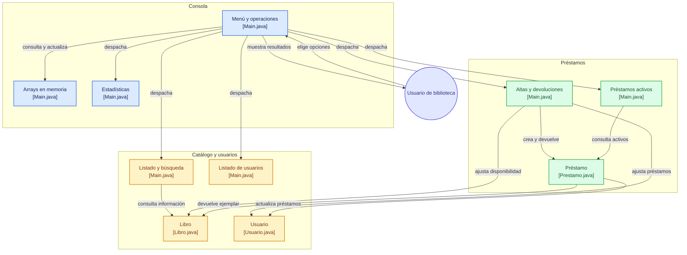

# Sistema de gestión de biblioteca

Aplicación de consola desarrollada en Java para gestionar libros, usuarios y préstamos usando arrays de objetos. El proyecto permite llevar el control del catálogo, el registro de usuarios, las operaciones de préstamo y devolución, y las estadísticas básicas del sistema.

## Descripción general

La biblioteca funciona como una pequeña gestión en memoria, orientada a consola. Toda la lógica principal se concentra en `Main.java`, mientras que los modelos de dominio viven en clases separadas para mantener una estructura más clara y mantenible.

## Requisitos

- Java JDK 8 o superior
- Maven 3.6 o superior
- Git, si se desea clonar o publicar el proyecto

## Ejecución

Desde la carpeta raíz del proyecto:

```bash
mkdir -p out
javac -d out src/main/java/biblioteca/*.java
java -cp out biblioteca.Main
```

La carpeta `out/` contiene únicamente los archivos compilados y queda excluida de Git.

También se puede compilar con Maven:

```bash
mvn clean package
java -cp target/classes biblioteca.Main
```

## Funcionalidades

El menú ofrece las siguientes operaciones:

1. Mostrar libros.
2. Mostrar usuarios.
3. Registrar préstamos.
4. Registrar devoluciones.
5. Mostrar préstamos activos.
6. Buscar libros por código.
7. Consultar estadísticas.
8. Salir.

## Diagrama de flujo del sistema



## Estructura del proyecto

```text
sistema-gestion-biblioteca/
├── src/main/java/biblioteca/
│   ├── Main.java
│   ├── Libro.java
│   ├── Usuario.java
│   └── Prestamo.java
├── pom.xml
├── .gitattributes
├── .gitignore
├── LICENSE
└── README.md
```

- `src/main/java/biblioteca/Main.java`: inicia la aplicación y contiene el menú principal.
- `src/main/java/biblioteca/Libro.java`: representa los libros y su disponibilidad.
- `src/main/java/biblioteca/Usuario.java`: representa a los usuarios y su historial de préstamos.
- `src/main/java/biblioteca/Prestamo.java`: representa la relación entre un usuario y un libro prestado.

## Publicar en GitHub

1. Crea un repositorio vacío en GitHub.
2. Conecta el repositorio remoto:

   ```bash
   git remote add origin https://github.com/USUARIO/NOMBRE-DEL-REPOSITORIO.git
   ```

3. Guarda los cambios y publícalos:

   ```bash
   git add .
   git commit -m "Preparar proyecto para GitHub"
   git push -u origin main
   ```
