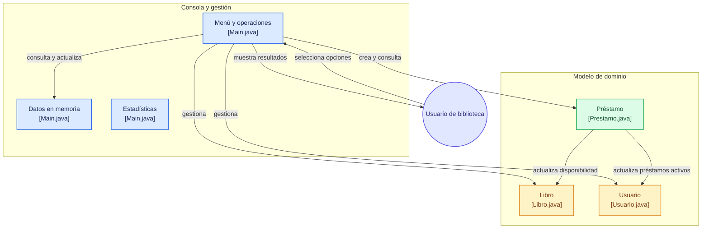

# 📚 Sistema de Gestión de Biblioteca

Aplicación de consola desarrollada en **Java** para gestionar libros, usuarios y préstamos mediante **Programación Orientada a Objetos (POO)** y estructuras de datos basadas en arrays.

El sistema permite consultar el catálogo, administrar usuarios, registrar préstamos y devoluciones, realizar búsquedas y obtener estadísticas básicas de la biblioteca.


---

## ✨ Características

* 📚 Gestión de libros y ejemplares disponibles.
* 👤 Gestión de usuarios.
* 📖 Registro y consulta de préstamos.
* 🔄 Registro de devoluciones.
* 🔎 Búsqueda de libros mediante código.
* 📊 Generación de estadísticas del sistema.
* 🧮 Control de límites de préstamos según el tipo de usuario.
* ⏱️ Validación de días máximos de préstamo.
* 🆔 Generación automática de identificadores para nuevos préstamos.
* 💾 Gestión de datos completamente **en memoria mediante arrays de objetos**.
* 🖥️ Interfaz interactiva mediante consola.

---

## 🧠 Arquitectura

El sistema utiliza una estructura sencilla basada en **Programación Orientada a Objetos**, separando el modelo de dominio de la lógica principal de la aplicación.



### Flujo principal

El usuario interactúa con el menú de `Main.java`. Dependiendo de la opción seleccionada, el sistema consulta o modifica las entidades correspondientes.

Por ejemplo, al realizar un préstamo:

```text
Usuario
   │
   ▼
Main.java
   │
   ├── verifica Usuario
   │
   ├── verifica Libro
   │
   ├── valida disponibilidad
   │
   ├── valida límite de préstamos
   │
   ├── valida días permitidos
   │
   ▼
Prestamo
   │
   ├── actualiza Libro
   └── actualiza Usuario
```

---

## 🛠️ Tecnologías

| Tecnología       | Uso                                |
| ---------------- | ---------------------------------- |
| ☕ Java           | Lenguaje principal                 |
| 📦 Maven         | Gestión y compilación del proyecto |
| 🖥️ Java Console | Interfaz de usuario                |
| 🧱 POO           | Modelado de las entidades          |
| 📚 Arrays        | Almacenamiento de datos en memoria |
| 🔀 Git           | Control de versiones               |

---

## 📂 Estructura del proyecto

```text
sistema-gestion-biblioteca/
│
├── src/
│   └── main/
│       └── java/
│           └── biblioteca/
│               ├── Main.java
│               ├── Libro.java
│               ├── Usuario.java
│               └── Prestamo.java
│
├── pom.xml
├── LICENSE
└── README.md
```

### Clases principales

**`Main.java`**

Contiene el punto de entrada de la aplicación, el menú principal y la lógica de las operaciones del sistema.

**`Libro.java`**

Representa los libros de la biblioteca y administra información como código, título, autor, género, disponibilidad y estado.

**`Usuario.java`**

Representa a los usuarios y mantiene información personal, tipo de usuario y cantidad de préstamos activos.

**`Prestamo.java`**

Representa un préstamo y relaciona un usuario con un libro. También controla el estado del préstamo y las operaciones de devolución.

---

## 📋 Funcionalidades

### 1. Mostrar libros

Permite consultar la información de todos los libros registrados:

* Código
* Título
* Autor
* Género
* Ejemplares disponibles
* Estado

### 2. Mostrar usuarios

Muestra los usuarios registrados junto con:

* Código
* Nombre
* Edad
* Tipo de usuario
* Préstamos activos

### 3. Realizar préstamo

Antes de registrar un préstamo, el sistema comprueba:

* Que el usuario exista.
* Que el libro exista.
* Que haya ejemplares disponibles.
* Que el usuario no haya alcanzado su límite de préstamos.
* Que la cantidad de días sea válida según el tipo de usuario.
* Que exista espacio disponible en el array de préstamos.

Los límites implementados son:

| Tipo de usuario | Máximo de préstamos | Máximo de días |
| --------------- | ------------------: | -------------: |
| Estudiante      |                   3 |        15 días |
| General         |                   2 |         7 días |

### 4. Registrar devolución

Permite seleccionar un préstamo activo mediante su ID y registrar su devolución.

Al devolver un libro:

```text
Prestamo
   │
   ├── estado → DEVUELTO
   │
   ├── Libro → +1 ejemplar disponible
   │
   └── Usuario → -1 préstamo activo
```

### 5. Mostrar préstamos activos

Muestra únicamente los préstamos cuyo estado actual es `ACTIVO`.

### 6. Buscar un libro

Permite localizar un libro utilizando su código.

### 7. Mostrar estadísticas

El sistema calcula información como:

* Cantidad total de libros.
* Ejemplares disponibles.
* Disponibilidad por título.
* Cantidad de préstamos activos.
* Usuarios con préstamos.
* Libro con mayor cantidad de ejemplares disponibles.
* Cantidad de usuarios estudiantes.
* Cantidad de usuarios generales.

---

## ▶️ Ejecución

### Requisitos

* **JDK 8 o superior**
* **Maven 3.6 o superior**
* Git, si deseas clonar el repositorio.

### Ejecutar con Java

Desde la raíz del proyecto:

```bash
mkdir -p out
javac -d out src/main/java/biblioteca/*.java
java -cp out biblioteca.Main
```

### Ejecutar con Maven

Compilar el proyecto:

```bash
mvn clean package
```

Ejecutar:

```bash
java -cp target/classes biblioteca.Main
```

---

## 🖥️ Menú de la aplicación

Al iniciar el programa se muestra el menú principal:

```text
-- Menú Principal --

Ingrese la opción que desee:

1. Mostrar libros.
2. Mostrar usuarios.
3. Realizar préstamo.
4. Registrar devolución.
5. Mostrar préstamos activos.
6. Buscar un libro.
7. Mostrar estadísticas.
8. Salir.
```

---

## 🧩 Conceptos de Java aplicados

Este proyecto fue desarrollado como práctica de fundamentos de Java y Programación Orientada a Objetos.

Entre los principales conceptos utilizados se encuentran:

* Clases y objetos.
* Atributos y métodos.
* Constructores implícitos.
* Arrays de objetos.
* Referencias entre objetos.
* Métodos de instancia.
* `String`.
* Tipos primitivos.
* Condicionales `if / else`.
* Estructuras `switch`.
* Bucles `for`.
* `try / catch`.
* `Scanner`.
* `InputMismatchException`.
* `toString()`.
* Modificadores de acceso.
* Relaciones entre objetos.

### Relaciones principales

```text
Usuario
   ▲
   │
   │ pertenece a
   │
Prestamo
   │
   │ contiene
   ▼
Libro
```

Un objeto `Prestamo` mantiene referencias directas al `Usuario` y al `Libro` involucrados en la operación.

---

## 💾 Persistencia de datos

Actualmente, el sistema trabaja completamente **en memoria**.

Los libros, usuarios y préstamos se almacenan utilizando arrays de objetos:

```java
Libro[] libros = new Libro[10];
Usuario[] usuarios = new Usuario[5];
Prestamo[] prestamos = new Prestamo[15];
```

Por lo tanto, los datos no se almacenan en una base de datos ni en archivos externos y se reinician al volver a ejecutar el programa.

---

## 🚀 Posibles mejoras futuras

Algunas mejoras que podrían incorporarse en futuras versiones:

* [ ] Persistencia mediante archivos.
* [ ] Base de datos.
* [ ] Interfaz gráfica.
* [ ] Separación de la lógica de negocio en servicios.
* [ ] Uso de `ArrayList` en lugar de arrays fijos.
* [ ] Validaciones más robustas de entrada.
* [ ] Sistema de autenticación.
* [ ] Historial completo de préstamos.
* [ ] Fechas reales de préstamo y devolución.
* [ ] Sistema de multas por retrasos.
* [ ] Pruebas unitarias con JUnit.

---

## 📄 Licencia

Este proyecto está disponible bajo la licencia **MIT**.

Consulta [`LICENSE`](LICENSE) para conocer los términos completos.

---

## 👨‍💻 Autor

**Ian Arica**

Proyecto desarrollado como práctica de **Java, Programación Orientada a Objetos y gestión de estructuras de datos en memoria**.

---

<p align="center">
  <sub>📚 Sistema de Gestión de Biblioteca · Java · Maven · POO</sub>
</p>
